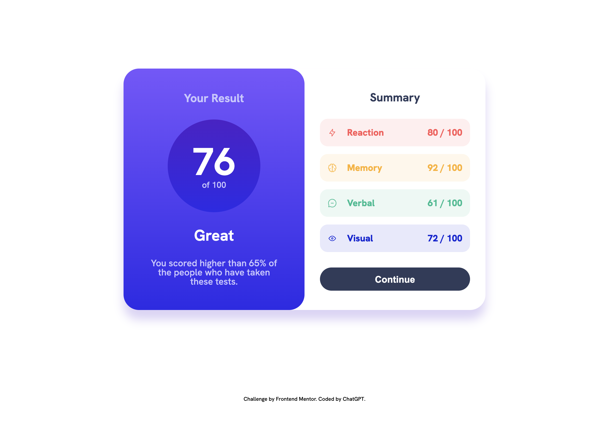
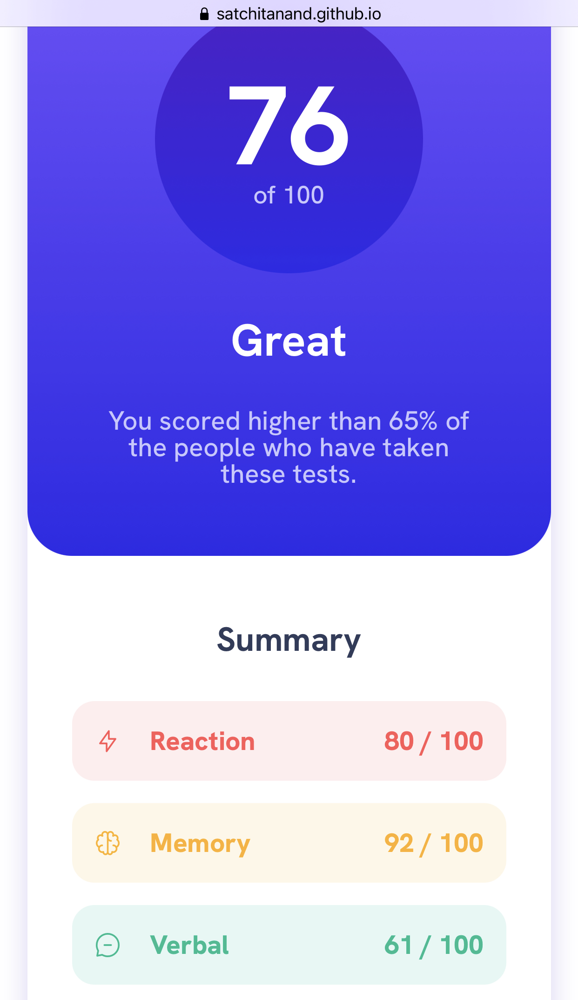

# Frontend Mentor - Results summary component solution

This is a solution to the [Results summary component challenge on Frontend Mentor](https://www.frontendmentor.io/challenges/results-summary-component-CE_K6s0maV). Frontend Mentor challenges help you improve your coding skills by building realistic projects. 

## Table of contents

- [Overview](#overview)
  - [The challenge](#the-challenge)
  - [Screenshot](#screenshot)
  - [Links](#links)
- [My process](#my-process)
  - [Built with](#built-with)
  - [What I learned](#what-i-learned)
  - [Continued development](#continued-development)
  - [Useful resources](#useful-resources)
- [Author](#author)
- [Acknowledgments](#acknowledgments)

## Overview

### The challenge

Users should be able to:

- View the optimal layout for the interface depending on their device's screen size
- See hover and focus states for all interactive elements on the page

### Screenshot




### Links

- Solution URL: [Results Summary Component Solution](https://github.com/satchitanand/005_Results_Summary_Component)
- Live Site URL: [Results Summary Component Site](https://satchitanand.github.io/005_Results_Summary_Component)

## My process

### Built with

- Semantic HTML5 markup
- CSS custom properties
- Flexbox
- CSS Grid
- Mobile-first workflow

### What I learned

During this project, I learned how to:

- Create a responsive layout using Flexbox
- Use CSS custom properties for easier color management and reusability
- Fetch and display data from a JSON file using JavaScript
- Center elements using Flexbox
- Apply hover and focus states to interactive elements

Here is some code that I am particularly proud of:
- creating two classes for a single HTML element (one common, and one unique)
- creating an id for an embedded element to reference it in JavaScript

```html
<div class="detail-box reaction-box">
          <div class="icon-text">
            
            <span>Reaction</span>
          </div>
          <span id="reaction-box-val">80 / 100</span>
        </div>
```

Some css code that was neat, was the use of a linear gradient to set the background color of a div, and creating a circular shape for a div by adjusting its border-radius, and removing margin from the last detail-box to avoid extra space below.

```css
background-image: linear-gradient(to bottom, var(--violet-blue), var(--light-royal-blue));

.score-circle {
  /* ... other properties ...*/
  border-radius: 50%;
  /* ... other properties ...*/
}

/* Remove margin from the last detail-box to avoid extra space */
.detail-box:last-child {
  margin-bottom: 0;
}
```

```js
document.addEventListener("DOMContentLoaded", function () {
  fetch("data.json")
    .then((response) => response.json())
    .then((data) => {
    /* a few lines of code */
    });
});
```

### Continued development

In future projects, I would like to continue improving my skills in:

JavaScript and JSON data handling
CSS Grid for more complex layouts
Exploring CSS frameworks and libraries for faster development

#### In general

This is what was recommended for me when I asked ChatGPT the question.  I am amazed!

*JavaScript frameworks and libraries:* As I become more proficient in vanilla JavaScript, you might want to explore popular frameworks 
and libraries like React, Angular, or Vue.js. These tools can help you build more complex and feature-rich applications with better per
formance and maintainability.

*CSS preprocessors:* Learning CSS preprocessors like Sass or Less can help you write more organized and maintainable CSS code. These to
ols offer features like variables, mixins, and nesting that can make your stylesheets more modular and scalable.

*State management:* As your applications grow in complexity, managing application state becomes more challenging. Learning state manage
ment libraries like Redux or MobX for React applications, or Vuex for Vue.js applications, can help you manage state effectively and bu
ild more complex applications.

*Accessibility:* Understanding web accessibility best practices and techniques is essential to build inclusive web applications. Focus on learning how to make your applications accessible to a wider range of users, including those with disabilities.

*Performance optimization:* Learn about performance optimization techniques such as lazy-loading, code splitting, and caching to ensure that your applications load quickly and provide a smooth user experience.

*Testing:* Become familiar with testing tools and methodologies, like unit testing, integration testing, and end-to-end testing. Learning testing frameworks like Jest, Mocha, or Cypress can help you create more robust and reliable applications.

*Web APIs:* Deepen your knowledge of various web APIs, such as the Fetch API, Web Storage API, and Geolocation API. This can help you create more feature-rich and interactive applications.

*Version control:* If you haven't already, learn how to use a version control system like Git to better manage your code, collaborate with others, and track changes in your projects.

*Build tools and bundlers:* Familiarize yourself with build tools like Webpack, Parcel, or Rollup.js to automate tasks, bundle your assets, and optimize your application for production.

*Backend development:* As you become more comfortable with frontend development, you may want to explore backend development with technologies like Node.js, Express, or Django. Learning about databases, RESTful APIs, and server-side rendering can help you become a full-stack developer.

### Useful resources

- https://chat.openai.com/
- [MDN Web Docs](https://developer.mozilla.org/) - This resource is invaluable for understanding HTML, CSS, and JavaScript concepts.
- [CSS-Tricks](https://css-tricks.com/) - A great website for learning and keeping up with CSS techniques and best practices.
- [Frontend Mentor](https://www.frontendmentor.io/) - A platform that provides realistic coding challenges to help improve frontend skills.

## Author

- Website - [Anand Ramachandran](https://github.com/satchitanand)
- Frontend Mentor - [@satchitanand](https://www.frontendmentor.io/profile/satchitanand)

## Acknowledgments

I would like to thank the ChatGPT by OpenAI for providing valuable assistance and guidance throughout the development of this project.